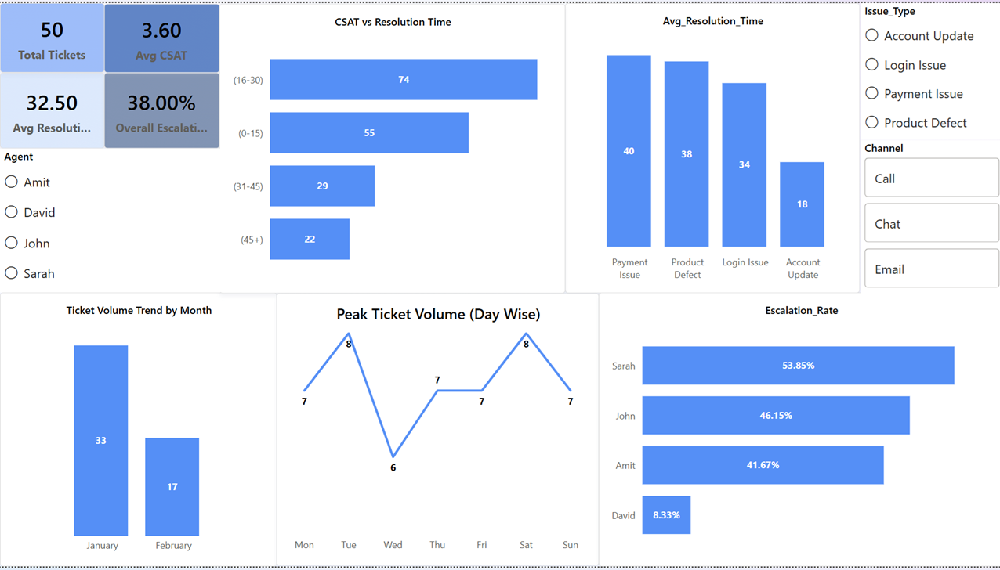

# 📊 Customer Support Ticket Trend & Root Cause Analysis

---
## 📊 Power BI Dashboard

## 📌 Business Problem

Customer support operations generate large volumes of tickets across multiple channels. Management requires visibility into ticket trends, resolution efficiency, escalation patterns, and customer satisfaction impact to optimize staffing, reduce escalations, and improve service quality.

This project analyzes support ticket data to identify performance gaps, recurring issues, and operational improvement opportunities.

---

## 📂 Dataset Overview

The dataset consists of 40+ simulated customer support tickets designed to reflect realistic call center operations.

### Columns Included:

* Ticket_ID
* Date
* Issue_Type (Login Issue, Payment Issue, Product Defect, Account Update)
* Resolution_Time (Minutes)
* Agent
* Escalated (Yes/No)
* Customer_Satisfaction_Score (1–5)
* Channel (Call, Chat, Email)

The dataset was structured to allow performance comparisons across agents, issue types, and time periods.

---

## 🛠 Tools & Technologies Used

* **Microsoft Excel** – Data cleaning, Pivot Tables, Dashboard design
* **SQL** – Aggregation queries, filtering, grouping, KPI calculations
* **Power BI** – Data modeling, DAX measures, interactive dashboard creation

---

## 📈 Key Performance Indicators (KPIs)

* Total Tickets
* Average Resolution Time
* Escalation Rate
* Average Customer Satisfaction Score (CSAT)

---

## 🔍 Key Insights

1. **Ticket Volume Trend:** January recorded 33 tickets (66%) while February had 17 tickets (34%), indicating a significant workload concentration in January.
2. **Issue Complexity & Resolution Time:** Payment Issues (40 mins) and Product Defects (38 mins) have the highest average resolution times. Login Issues average 34 mins, while Account Updates are resolved fastest at 18 mins.
3. **Resolution Time vs CSAT:** There is a strong negative correlation between handling time and satisfaction. CSAT averages: 0–15 mins → 5.00, 16–30 mins → 4.35, 31–45 mins → 2.90, 45+ mins → 1.83.
4. **Escalation Rate by Agent:** Sarah (53.85%) and John (46.15%) show higher escalation dependency, while David demonstrates strong first-level resolution capability with only 8.33%.
5. **Peak Ticket Days:** Tuesday and Saturday recorded the highest ticket volume (8 each), while Wednesday had the lowest (6), indicating uneven daily workload distribution.

---

## 💡 Recommendations

* Align staffing capacity with monthly demand trends, especially if January represents a seasonal spike.
* Provide targeted training and process optimization for Payment and Product-related tickets; consider specialized queues for complex cases.
* Establish a KPI target to resolve tickets within 30 minutes and implement first-contact resolution strategies.
* Conduct knowledge-sharing sessions leveraging high-performing agents’ best practices and review escalation criteria for consistency.
* Increase staffing coverage on high-volume days (Tuesday, Saturday) and use lower-volume days (Wednesday) for training and quality reviews.

---

## 📊 Dashboard Overview

The Power BI dashboard includes:

* KPI Cards (Total Tickets, Avg Resolution Time, Escalation Rate, Avg CSAT)
* Ticket Volume Trend (Line Chart)
* Resolution Time by Issue Type (Bar Chart)
* Escalation Rate by Agent (Column Chart)
* Interactive Slicers (Agent, Issue Type, Channel)

---

## 🚀 Project Outcome

This project demonstrates the ability to:

* Transform raw operational data into actionable insights
* Design KPI-driven dashboards
* Apply SQL for structured analysis
* Communicate findings with clear business recommendations

---

## 📌 Author

Harpreet Singh
Aspiring Data Analyst | Excel | SQL | Power BI
